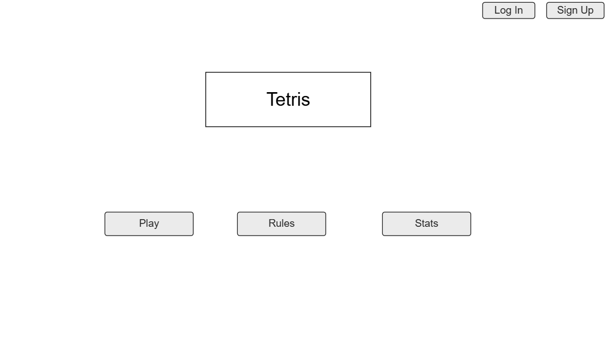
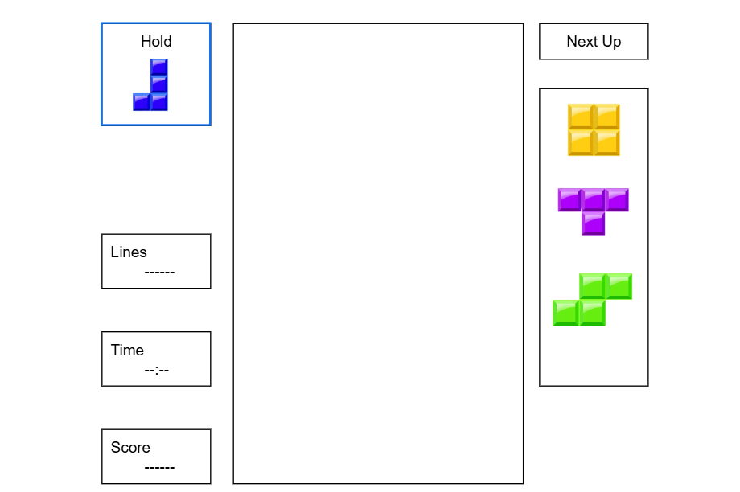
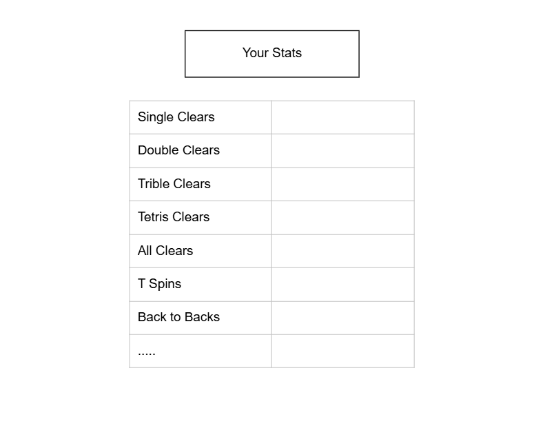
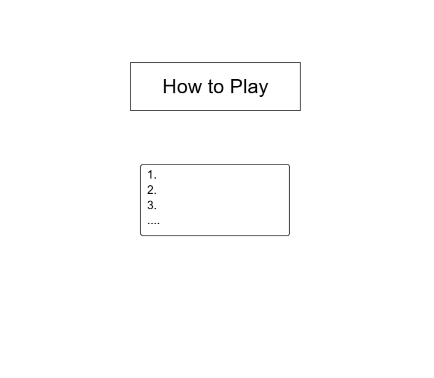

# Final Project: Tetris

## Project Spec

For my project, I'm going to create a Tetris web app. The goal is to create the
game to be as close to the actual game of Tetris as possible. If you're unfamiliar with
Tetris, the object of the game is pretty simple. The goal is to stack pieces to create
horizontal lines. When you create a horizontal line that covers the entire width of the playing
space, that line disappears and you get points. If you let the pieces stack too high
without creating any complete horizontal lines, you lose. There are 7 pieces, called tetriminos,
all of which are made up of 4 'blocks'. There's a '|', a square, a 'T', a forwards 'z', a backwards 'z',
a forwards 'L', and a backwards 'L'. The player is given one of these pieces at a time, and are
allowed to rotate the piece 90 degrees at a time to make it fit how they want. But you can't just
sit their and look forever at where to put a piece. Once the piece enters the top of the frame, it slowly
starts to fall straight down so you're forced to make a decision. The game area itself is 10 blocks wide 
and 20 blocks tall. 

Now, there is more to the game than just trying not to let the stack of blocks get to the top
of the board (although that is the main objective). Whenever a player clears a line, they get points
added to their score. The more difficult the line clear they make, the more points they score. For
example, you could play it safe and clear one line at a time, trying to keep the stack as low as 
possible. While this is a good stradegy for not losing, you would be getting the minimum amount of
points each time you cleared a line. Or, you could purposely stack blocks higher in the attempt to
clear multiple lines at once. The most you can clear at one time is 4 (this is called a 'Tetris', ha
get it?), which grants a much higher score than just doing 1 at a time. Many people play with the goal
of getting the highest score possible.

The target audience will be anyone who likes to play web games and likes Tetris, but really anyone can play. It's a simple concept
that anyone can understand and have fun with. 

The app will store several different types of data that will be specific to each user. The goal would be for each user to 
create an 'account' that keeps track of their stats in the game. This includes high scores, longest games, the number of single
lines they've cleared, double lines they've cleared, etc. There could be room for more data to keep track of depending
on how many features I'm able to implement, such as games won, highest round, and more. The goal would be to 
have a page where the user can see all their stats, and another page that ranks the stats of everyone who's played the
game so you can see how you stack up to others.

Once I get the base game working, I have a couple things I'd like to implement that would make
the game much more interesting. First off, I'd like to add some difficulty to the game by increasing
the speed at which the tetriminos drop depending on the player's score. The more the player scores, the
faster the pieces fall. This is typically done in 'rounds', where once a player meets a certain threshhold,
say 1000 points, the speed slightly increases. Over time these increases at up to where you only have a split
second to decide where to put a piece. After that, I'd like to implement some different game modes so the 
player can decide how they want to play the game. There would of course be the traditional endless mode
where you go for as long as you can, but I'd also like a timed mode where you try to score as high as
you can in a certain amount of time, a race mode where to try to reach a certain score as fast as you can, and
even a chill mode where the speed never gets above a certain limit. 

## Project Wireframe

